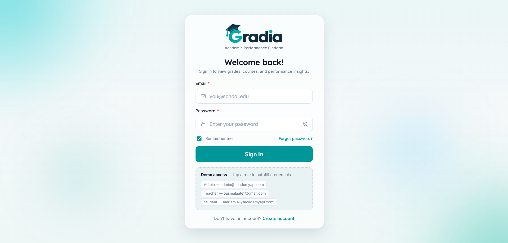
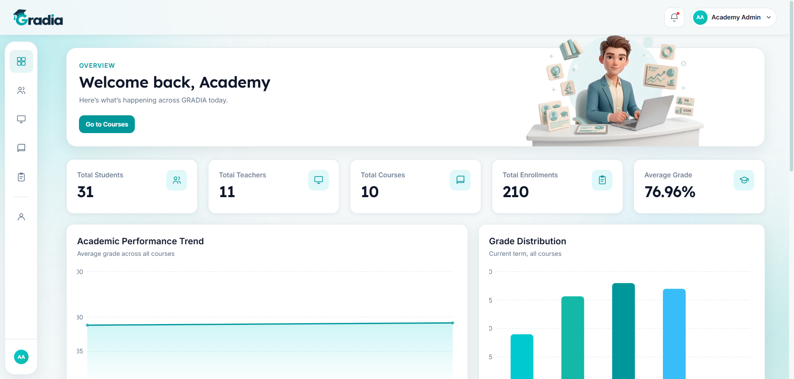
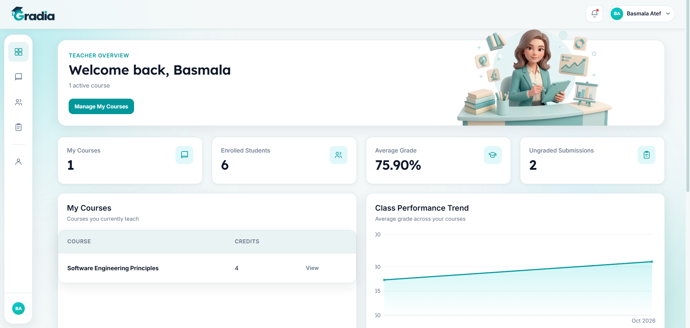
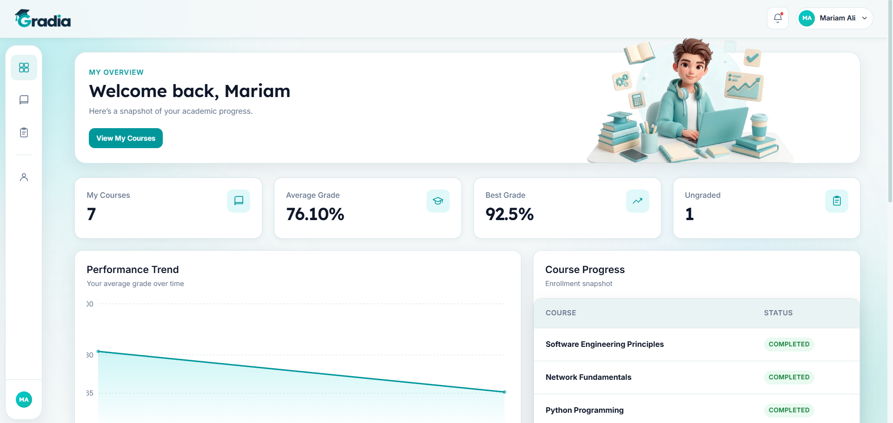
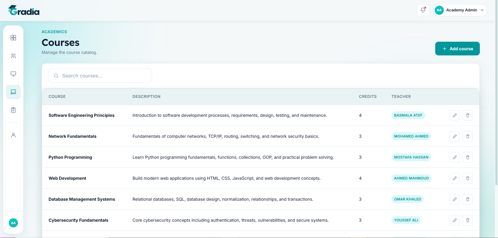
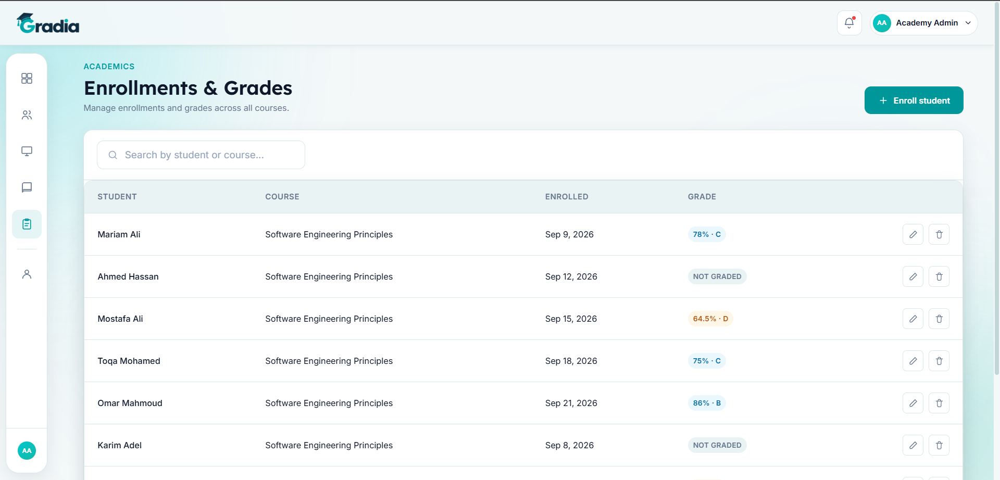

🎓 GRADIA — Academic Management System

A full-stack academic management platform for schools and academies, built with ASP.NET Core Web API and React.

GRADIA allows admins to manage students, teachers, and courses, enables teachers to track and grade their classes, and gives students a clear view of their enrollments and grades — all secured with JWT authentication and role-based access control.

📸 Screenshots

Login | Admin Dashboard

 | 

Teacher Dashboard | Student Dashboard

 | 

Courses | Enrollments & Grades

 | 

✨ Features

👑 Admin

* Full CRUD operations for students, teachers, and courses
* Enroll students in courses and manage grades platform-wide
* Dashboard with system-wide statistics
* Grade distribution and performance trend charts
* Recent activity feed

👨‍🏫 Teacher

* View and grade only the courses and students assigned to them
* Server-side authorization enforced through JWT
* Personal dashboard with class performance trends
* Recent grading activity

🎓 Student

* Self-registration
* View enrolled courses and grades
* Personal performance trend
* Grade distribution

🔐 Core

* JWT-based authentication
* BCrypt password hashing
* Role-based authorization for Admin, Teacher, and Student
* Consistent API response format: { success, message, data }
* Pagination and search across resources
* Server-side authorization and data isolation

🛠️ Tech Stack

Backend

* ASP.NET Core Web API (.NET 10)
* Entity Framework Core — Database First
* SQL Server
* JWT Bearer Authentication
* BCrypt.Net
* Swagger / Swashbuckle

Frontend

* React 18
* Vite
* React Router
* Recharts
* Context API
* Plain CSS with a design-token system

🏗️ Architecture

Controller → Interface → Service → DbContext → SQL Server

The project follows a straightforward layered architecture focused on clarity and maintainability.

The project intentionally does not use the Repository Pattern, CQRS/MediatR, or Minimal APIs.

📁 Project Structure

gradia-academy-system/
│
├── backend/
│   ├── Controllers/
│   ├── DTOs/
│   ├── Interfaces/
│   ├── Middleware/
│   ├── Models/
│   ├── Services/
│   ├── database/
│   │   └── init.sql
│   ├── appsettings.Example.json
│   └── Program.cs
│
├── frontend/
│   ├── src/
│   │   ├── components/
│   │   ├── context/
│   │   ├── features/
│   │   ├── routes/
│   │   ├── services/
│   │   │   └── api/
│   │   └── utils/
│   └── .env.example
│
├── docs/
│   └── screenshots/
│
└── README.md

🚀 Getting Started

Prerequisites

* .NET 10 SDK
* Node.js v18+
* SQL Server
* SQL Server Management Studio or Azure Data Studio

SQL Server Express is also supported.

1. Clone the Repository

git clone https://github.com/BasmalaAtef-dev/gradia-academy-system.git

cd gradia-academy-system

2. Set Up the Database

Open:

backend/database/init.sql

Run the script using SQL Server Management Studio.

The script will:

* Create the AcademyDB database
* Create all required tables
* Configure relationships and constraints
* Seed demo accounts
* Seed teachers and students
* Seed courses and enrollments

3. Configure and Run the Backend

Navigate to the backend folder:

cd backend

Create your local configuration from the example file:

cp appsettings.Example.json appsettings.json

Open appsettings.json and configure:

* ConnectionStrings:DefaultConnection
* Jwt:Key

The JWT key should be a secure random string of at least 32 characters.

Then run:

dotnet restore

dotnet run

The API will be available at:

https://localhost:7185

The port may differ depending on your local configuration. Always check the URL shown in the terminal.

4. Configure and Run the Frontend

Navigate to the frontend folder:

cd frontend

Create the environment file:

cp .env.example .env

Make sure the API URL matches your backend configuration.

Example:

VITE_API_BASE_URL=https://localhost:7185/api

Install dependencies:

npm install

Start the development server:

npm run dev

The frontend will be available at:

http://localhost:5173

🔑 Demo Accounts

| Role    | Email                                                         | Password   |
| ------- | ------------------------------------------------------------- | ---------- |
| Admin   | [admin@academyapi.com](mailto:admin@academyapi.com)           | Admin@123  |
| Teacher | [basmalaatef@gmail.com](mailto:basmalaatef@gmail.com)         | 123456     |
| Student | [mariam.ali@academyapi.com](mailto:mariam.ali@academyapi.com) | Stud@3001! |

These accounts are pre-seeded by init.sql and can also be selected from the login page's Demo Access panel.

📡 API Overview

All API endpoints are prefixed with /api.

Every response follows a consistent structure:

{
"success": true,
"message": "...",
"data": { ... }
}

| Resource    | Base Route  | Notes                                  |
| ----------- | ----------- | -------------------------------------- |
| Auth        | /Auth       | Login and registration                 |
| Students    | /Student    | Admin/Teacher access                   |
| Teachers    | /Teacher    | Admin access                           |
| Courses     | /Course     | Teacher-scoped access                  |
| Enrollments | /Enrollment | Grades, distribution, and trend        |
| Dashboard   | /Dashboard  | Summary statistics and recent activity |
| Profile     | /Profile    | Current user's profile (/me)           |

Full API documentation is available through Swagger after starting the backend:

https://localhost:7185/swagger

🔒 Security

* Passwords are securely hashed using BCrypt and are never stored as plain text.
* JWT tokens contain the authenticated user's role and are validated for protected requests.
* Teachers and students are restricted to the data they are authorized to access.
* Authorization is enforced server-side rather than relying only on frontend visibility.
* Sensitive configuration files such as appsettings.json and .env are excluded from version control.
* Only example configuration files are included in the repository.

👩‍💻 Author

Basmala Atef

LinkedIn:
https://www.linkedin.com/in/basmala-atef-44655425b/

GitHub:
https://github.com/BasmalaAtef-dev

📄 License

This project is licensed under the MIT License.

It is intended primarily for learning, portfolio, and educational purposes.
